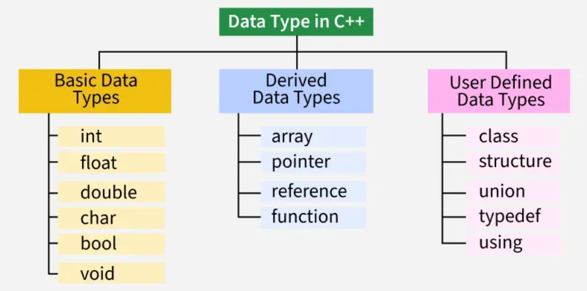
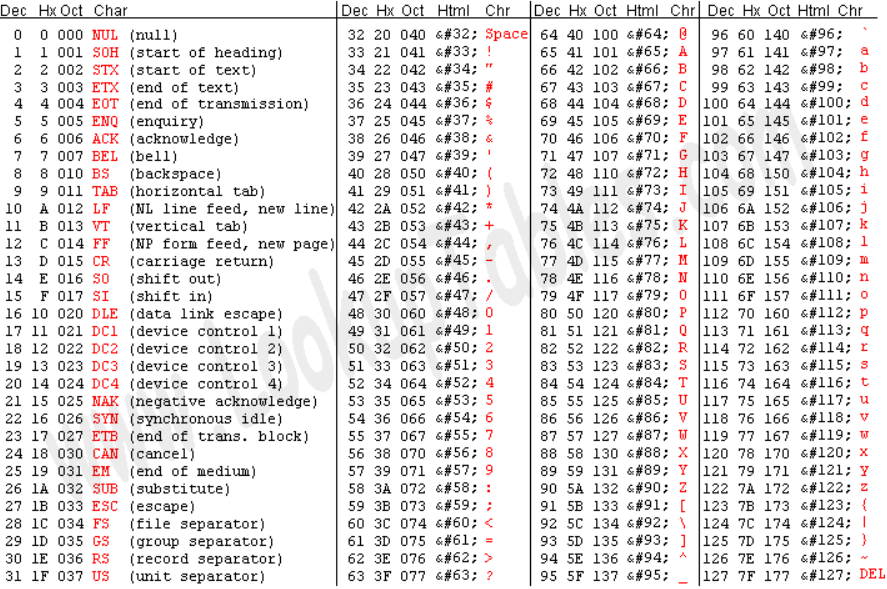

# C++ Data Types :-

### *A data type specifies what type of values a variable should hold , ex - int , float , string etc. The compiler allocates memory for the variable based on the given data type , different data types may require a different amount of memory.*



### C++ Data Types :-

1) Character (char) :-

* stores a single character in single quotes ('')
* is 1 byte in size
* uses char keyword
* can store 256 characters based on ASCII codes.

#### ❄ Below is the ASCII table in which each integer value corresponds to a character



### ASCII Character Encoding :-

*It stands for American Standard Code for Information Interchange and has been used as a foundational element in computing , below are some important points regarding ASCII Encoding Format :-*

* it uses 7 bits to encode 128 characters ranging from 0 -  127 , modern ASCII uses 8 bits where the MSB is kept 0 (signed bit representation)
* There are 95 codes (32-126) for printable characters such as space , digits , upper/lower case , English letters , punctuations , symbols
* and 32 non printable characters (0-31,127) which are used for formatting and control , ex - NUL , LF , CR
* it is a legacy system , and serves as the basis for Unicode's first 128 code points as 'A' is U+0041 (hexadecimal) in Unicode which corresponds to 0065 (decimal) in ASCII


2) Integer (int) :-

* used to store integer values
* it is universally 4 bytes(32 bits) for both 32 and 64 bit architectures
* it is signed (contains both + and - numbers)
* range is -(2^(31)) to 2^(31)-1
* it also stores octal , hexadecimal , binary values in the above range

```cpp
#include <iostream>
int main(){
    int a=20;
    std::cout<<"Value of a is: "<<a<<std::endl;
    int hex_val=0x25;
    std::cout<<"Value of hex_val in decimal is: "<<hex_val<<std::endl;
    return 0;
}
```

3) Boolean (bool) :-

*  used to store truth values / logical values 
* true(1) and false(0)
* size is 1 byte
```cpp
#include <iostream>
int main(){
    bool val=true;
    int int_val=val;
    std::cout<<"Logical bool value: "<<val<<std::endl
    std::cout<<"Logical int value: "<<int_val<<std::endl;
}
```

4) Floating point (float) :-

* used to store floating point numbers
* uses float keyword to store them
* size is 4 bytes on both 32 and 64 bit systems
* can store values in the range from 1.2e-38 to 3.4e+38
```cpp
#include <iostream>
int main(){
    float val=3.1415;
    std::cout<<"floating point value: "<<val<<std::endl;
}
```
5) Double data type(double) :-

* used to store floating point numbers with a higher precision than float data type
* uses double keyword to store such values
* size is 8 bytes and can store values in the range of 1.7e-308 to 1.7e+308
```cpp
#include <iostream>
int main(){
    double e=2.7182818284590452353602;
    std::cout<<"double precision value: "<<e<<std::endl;
}
```

6) Void data type(void) :-

* it is used to indicate the absence of value for a variable
* it cannot be used for variables but for functions and pointers that don't return any value
* it holds size depending on system architecture


#### ❄ Type Safety in C++ :-

*C++ is strongly types implying that the type of variables must be known before compilation and it doesn't change during the execution of the program , we cannot assign a different value to a variable of another type , ex - assigning a floating point number to a bool value might cause compilation error.*

### Data type conversion :-

*Data type conversion refers to changing the type of one variable to another compatible one without losing its original meaning*

```cpp
#include <iostream>
int main(){

    int num=3;
    char c='C';
    std::cout<<"ASCII value of C: "<<(int)c<<std::endl;
    std::cout<<"ASCII value of C added to num: "<<num+(int)c<<std::endl;

    return 0;

}
```
### Data type modifiers :-

*Modifiers are used to change or give additional meaning to existing data types , they are used to increase the size/range of existing data types.*

```cpp
#include <iostream>
int main(){
    int num=20;//4 bytes
    long int long_num=400;//8 bytes

}
``` 
#### ❄ In the above code, long int is used to store a larger range of int (-(2^63) to (2^63 -1)) as compared to that of int.

