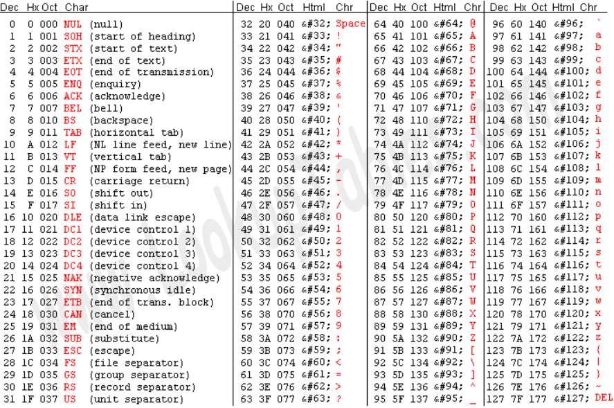

# C++ Data Types :-

### *A data type specifies what type of values a variable should hold , ex - int , float , string etc. The compiler allocates memory for the variable based on the given data type , different data types may require a different amount of memory.*

### C++ Data Types :-

1) Character (char) :-
* stores a single character in single quotes ('')
* is 1 byte in size
* uses char keyword
* can store 256 characters based on ASCII codes.

#### ❄ Below is the ASCII table in which each integer value corresponds to a character

### ASCII Character Encoding :-

*It stands for American Standard Code for Information Interchange and has been used as a foundational element in computing , below are some important points regarding ASCII Encoding Format :-*

* it uses 7 bits to encode 128 characters ranging from 0 -  127 , modern ASCII uses 8 bits where the MSB is kept 0 (signed bit representation)
* There are 95 codes (32-126) for printable characters such as space , digits , upper/lower case , English letters , punctuations , symbols
* and 32 non printable characters (0-31,127) which are used for formatting and control , ex - NUL , LF , CR
* it is a legacy system , and serves as the basis for Unicode's first 128 code points as 'A' is U+0041 (hexadecimal) in Unicode which corresponds to 0065 (decimal) in ASCII

